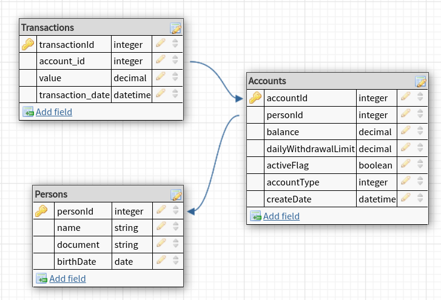

# Running the app

## development
#### step 1: create .env
#### step 2: set DATABASE_HOST=localhost
#### step 3: comment main container in docker-compose

```bash
$ docker-compose up
$ npm --force install
$ npm run start:dev
```

## production mode
#### step 1: create .env
#### step 2: set DATABASE_HOST=postgres

```bash
$ docker-compose up
```

# Test
```bash
# unit tests
$ npm run test
```

